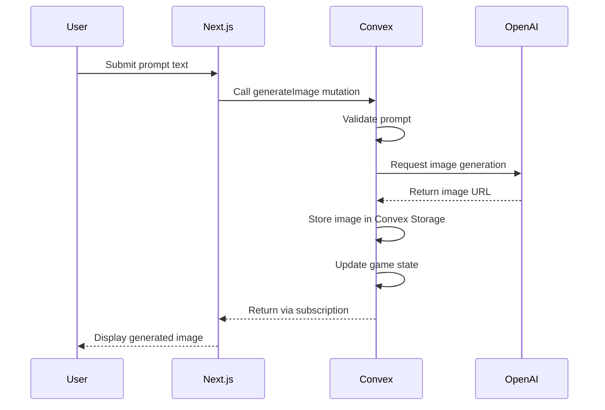
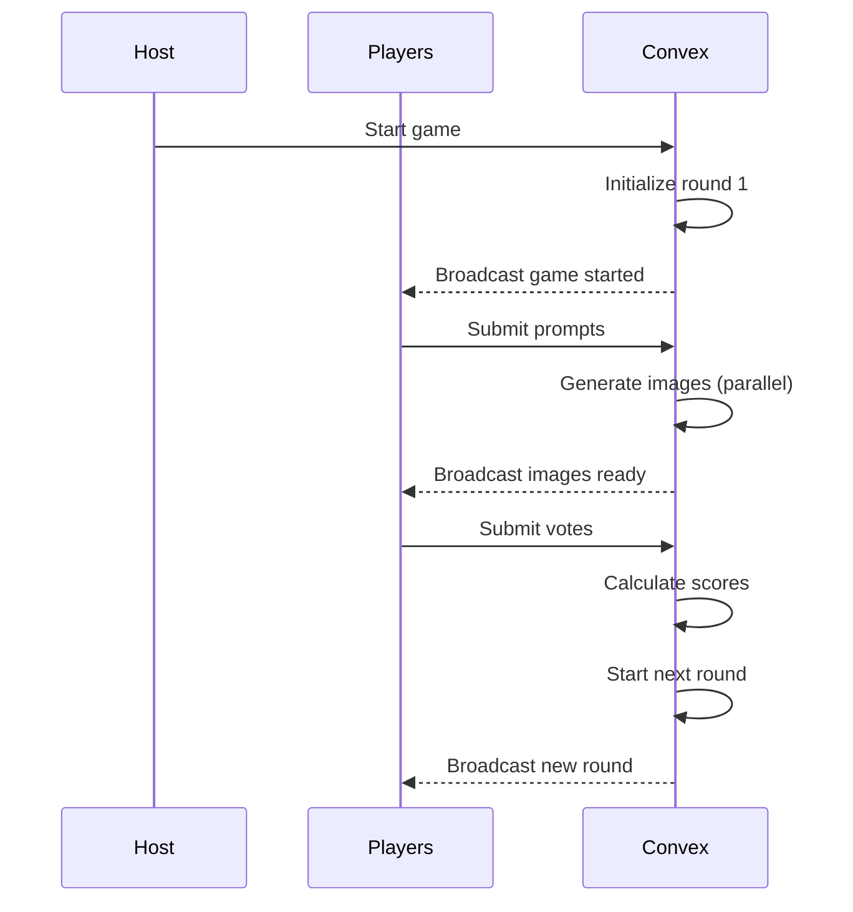

# Product Requirements Document: AI Image Party Game with Next.js & Convex

## 1. Executive Summary

### 1.1 Product Overview

An online multiplayer party game where players compete by generating AI images in response to creative prompts. Players submit text prompts to OpenAI's DALL-E API to generate images that best match the round's question card. A rotating "Card Czar" judges the submissions, awarding points for the most entertaining, creative, or fitting images. The game features a complete web application with marketing pages, authentication flows, user dashboards, and real-time gameplay powered by Convex's reactive backend.

### 1.2 Key Technologies

- **Frontend Framework**: Next.js 14 (App Router)
- **UI Components**: shadcn/ui + Tailwind CSS
- **Backend**: Convex (reactive database, functions, file storage)
- **Authentication**: Clerk (integrated with Next.js middleware)
- **AI Generation**: OpenAI Images API (DALL-E 3)
- **Deployment**: Vercel (Next.js) + Convex Cloud (backend)
- **Real-time**: Convex reactive subscriptions
- **Analytics**: Vercel Analytics + PostHog

### 1.3 Target Audience

- **Primary**: Adults aged 18-35 who enjoy creative party games and AI art
- **Secondary**: Friend groups looking for online entertainment
- **Tertiary**: Remote teams seeking creative ice-breaker activities

## 2. Product Goals & Objectives

### 2.1 Primary Goals

- Create a complete web application with landing page, auth, and game
- Enable viral growth through shareable room links with custom OG images
- Support 3-10 concurrent players per game room
- Generate high-quality AI images with optimized performance
- Achieve <10 second total image generation time for all players
- Leverage Next.js for SEO and Convex for real-time features

### 2.2 Success Metrics

- 10,000+ monthly active users within 6 months
- 40% week-over-week retention rate
- Average session duration of 30+ minutes
- 4.5+ star rating on review platforms
- <10 second average image generation time
- 99.9% uptime
- <$0.50 average cost per game session
- 25% conversion rate from landing page to sign-up

## 3. Application Architecture

### 3.1 Next.js App Structure

```
┌──────────────────────────────────────┐
│         Next.js Application          │
├──────────────────────────────────────┤
│                                      │
│  ┌────────────────────────────────┐ │
│  │   Marketing Pages (SSR/SSG)    │ │
│  │  • Landing Page                │ │
│  │  • Features                    │ │
│  │  • Pricing                     │ │
│  │  • How to Play                 │ │
│  └────────────────────────────────┘ │
│                                      │
│  ┌────────────────────────────────┐ │
│  │     Auth Flow (Clerk)          │ │
│  │  • Sign In/Up                  │ │
│  │  • OAuth Providers             │ │
│  │  • Email Verification          │ │
│  └────────────────────────────────┘ │
│                                      │
│  ┌────────────────────────────────┐ │
│  │    App Pages (Hybrid)          │ │
│  │  • Dashboard                   │ │
│  │  • Profile                     │ │
│  │  • Room Lobby                  │ │
│  └────────────────────────────────┘ │
│                                      │
│  ┌────────────────────────────────┐ │
│  │    Game Client (CSR)           │ │
│  │  • Real-time Game Play         │ │
│  │  • Convex Subscriptions        │ │
│  └────────────────────────────────┘ │
│                                      │
└──────────────────────────────────────┘
                    ↓
         Convex Backend Platform
         ├── Reactive Database
         ├── Scheduled Functions
         ├── File Storage
         └── Real-time Subscriptions
                    ↓
         External Services
         ├── OpenAI DALL-E API
         └── Clerk Authentication
```

### 3.2 File Structure

```
ai-image-party-game/
├── app/
│   ├── (marketing)/
│   │   ├── page.tsx                    # Landing page
│   │   ├── features/page.tsx           # Features page
│   │   ├── how-to-play/page.tsx        # Tutorial
│   │   ├── pricing/page.tsx            # Pricing
│   │   └── layout.tsx                  # Marketing layout
│   ├── (auth)/
│   │   ├── sign-in/[[...sign-in]]/page.tsx
│   │   ├── sign-up/[[...sign-up]]/page.tsx
│   │   └── layout.tsx                  # Minimal auth layout
│   ├── (app)/
│   │   ├── dashboard/page.tsx          # User dashboard
│   │   ├── profile/page.tsx            # User profile
│   │   ├── rooms/page.tsx              # Browse rooms
│   │   └── layout.tsx                  # App layout with nav
│   ├── room/
│   │   └── [code]/
│   │       ├── page.tsx                # Room lobby (shareable)
│   │       └── opengraph-image.tsx     # Dynamic OG image
│   ├── play/
│   │   └── [roomId]/
│   │       └── page.tsx                # Game client
│   ├── api/
│   │   ├── og/route.ts                 # OG image generation
│   │   └── webhooks/
│   │       └── clerk/route.ts          # Clerk webhooks
│   ├── layout.tsx                      # Root layout
│   ├── globals.css
│   └── providers.tsx                   # Client providers
├── components/
│   ├── marketing/
│   │   ├── hero.tsx
│   │   ├── features-grid.tsx
│   │   ├── testimonials.tsx
│   │   ├── cta-section.tsx
│   │   └── pricing-cards.tsx
│   ├── game/
│   │   ├── game-room.tsx
│   │   ├── prompt-input.tsx
│   │   ├── image-gallery.tsx
│   │   ├── voting-phase.tsx
│   │   ├── player-presence.tsx
│   │   └── round-timer.tsx
│   ├── dashboard/
│   │   ├── stats-cards.tsx
│   │   ├── recent-games.tsx
│   │   └── quick-actions.tsx
│   └── ui/                             # shadcn/ui components
│       ├── button.tsx
│       ├── card.tsx
│       └── ...
├── convex/
│   ├── schema.ts
│   ├── auth.config.js
│   ├── rooms.ts
│   ├── game.ts
│   ├── images.ts
│   └── ...
├── lib/
│   ├── utils.ts
│   └── constants.ts
├── public/
│   ├── images/
│   └── fonts/
├── middleware.ts                        # Clerk + Next.js middleware
├── next.config.js
├── tailwind.config.ts
└── package.json
```

## 4. State Management Patterns

### Client State (React)

- UI state (modals, dropdowns): useState
- Form state: react-hook-form or useState
- Navigation state: Next.js router

### Server State (Convex)

- All game state: Convex database
- Real-time updates: Convex subscriptions
- No client-side game state duplication

### State Update Flow

1. User action triggers Convex mutation
2. Mutation updates database
3. Subscriptions push updates to all clients
4. React components re-render with new data

⚠️ **IMPORTANT**: Never store game state in React state. All game state must live in Convex and be accessed via subscriptions.

## 5. Data Flow Diagrams

### 5.1 Image Generation Flow



### 5.2 Game State Flow



## 6. Feature Implementation Roadmap (UI-First Vertical Slices)

> **Philosophy Change**: This roadmap prioritizes building complete, polished UI components early to provide immediate visual progress and better user testing. Each feature includes both functionality AND polished user experience from day one.

### Feature 0: Foundation & Core UI System (Prerequisites)

**Definition of Done**: Complete UI foundation with visual game components working with mock data

**Implementation**:

- Next.js project setup with TypeScript and Tailwind ✅ (done)
- Convex backend initialization and connection ✅ (done)  
- Clerk authentication fully integrated ✅ (done)
- **NEW**: Complete shadcn/ui component system setup
- **NEW**: Core game UI components (room lobby, game interface, player cards)
- **NEW**: Navigation and layout components
- **NEW**: Design system with colors, typography, spacing
- **NEW**: All key user flows demonstrated with mock data
- Database schema for users table only
- Deploy to Vercel + Convex (establish CI/CD early)

**Acceptance Criteria**:

- ✅ New user can sign up with email or OAuth  
- ✅ User lands on dashboard after authentication
- ✅ Protected routes redirect to sign-in
- ✅ User data synced to Convex database
- **NEW**: ✅ Complete UI component library available
- **NEW**: ✅ Room lobby interface with mock players  
- **NEW**: ✅ Game interface with mock prompts and images
- **NEW**: ✅ Responsive design on all screen sizes
- **NEW**: ✅ Visual feedback and loading states

**Test Cases**:

```typescript
describe('Foundation & UI', () => {
  test('redirects unauthenticated users to sign-in', async () => {
    // Navigate to protected route
    // Verify redirect to /sign-in
  });
  
  test('syncs user data to Convex on first sign-in', async () => {
    // Sign up new user
    // Verify user record created in Convex
  });
  
  test('renders complete game UI with mock data', async () => {
    // Load game interface
    // Verify all components render correctly
    // Verify responsive design
  });
  
  test('component library works correctly', async () => {
    // Test key shadcn/ui components
    // Verify design system consistency
  });
});
```

### Feature 1: Room Management & Real-time Integration

**Definition of Done**: Users can create, join, and share rooms with live UI updates

**Implementation**:

- **Wire existing UI to Convex**: Connect room lobby components to real backend
- Room creation with unique 6-character codes  
- Room joining via code
- **Real-time player presence**: Live updates in lobby interface
- Shareable room links with dynamic OG images
- Database: rooms, players, presence tables
- Fixed room settings (8 players, 30s timer, 10 rounds)
- **Polish UI interactions**: Loading states, error handling, animations

**Acceptance Criteria**:

- ✅ User can create room with unique code
- ✅ User can join room with valid code
- ✅ Invalid codes show error message
- ✅ Lobby shows all connected players in real-time
- ✅ Room link generates custom OG image
- ✅ Two users can see each other in same room

**Test Cases**:

```typescript
describe('Room Management', () => {
  test('creates room with unique 6-char code', async () => {
    // Call createRoom mutation
    // Verify code is 6 uppercase letters
  });
  
  test('prevents duplicate room codes', async () => {
    // Create room with specific code
    // Try to create another with same code
    // Verify different code generated
  });
  
  test('allows joining with valid code', async () => {
    // Create room
    // Join with code
    // Verify player added to room
  });
  
  test('shows error for invalid code', async () => {
    // Try to join with non-existent code
    // Verify error message displayed
  });
  
  test('updates player count in real-time', async () => {
    // User A creates room
    // User B joins room
    // Verify User A sees User B immediately
  });
});
```

### Feature 2: Complete Game Flow with Polished UI

**Definition of Done**: Full game experience with placeholder images and refined interface

**Implementation**:

- **Connect game UI to backend**: Wire existing game components to Convex
- Start game from lobby (host only)
- Round progression state machine
- Card Czar rotation system  
- **Server-side timers**: Convex scheduled functions for phase transitions
- **Enhanced prompt submission**: Polished input with validation and character count
- **Improved placeholder system**: Attractive colored placeholders with player info
- **Refined voting interface**: Clear voting UI with player names and prompts
- Score tracking and animated score updates
- **Polished game over screen**: Detailed results with winner celebration
- Database: rounds, prompts, questionCards tables (seed with 100+ diverse cards)

**Acceptance Criteria**:

- ✅ Host can start game with 3+ players
- ✅ Each round has prompting → viewing → voting phases  
- ✅ Card Czar rotates each round
- ✅ Server-side timers enforce phase transitions automatically
- ✅ Players can submit prompts with real-time validation
- ✅ Attractive placeholders appear with player info and prompt text
- ✅ Card Czar can vote with clear interface showing all options
- ✅ Scores update with smooth animations after each round
- ✅ Game ends with detailed results screen and winner celebration
- **NEW**: ✅ All interactions feel responsive and polished
- **NEW**: ✅ Error states handled gracefully with user feedback

**Test Cases**:

```typescript
describe('Game Flow', () => {
  test('only host can start game', async () => {
    // Non-host tries to start
    // Verify error
    // Host starts game
    // Verify success
  });
  
  test('rotates card czar each round', async () => {
    // Start game with 3 players
    // Check czar for round 1
    // Complete round
    // Verify different czar for round 2
  });
  
  test('enforces timer for prompt phase', async () => {
    // Start round
    // Wait for timer expiry
    // Verify automatic transition to next phase
  });
  
  test('calculates scores correctly', async () => {
    // Player A wins round 1 (gets 1 point)
    // Player B wins round 2 (gets 1 point)
    // Verify scores: A=1, B=1, others=0
  });
  
  test('completes full game flow', async () => {
    // Play through all rounds
    // Verify game over screen
    // Verify final scores displayed
  });
});
```

### Feature 3: AI Image Generation

**Definition of Done**: Real AI images replace placeholders

**Implementation**:

- OpenAI API integration in Convex
- Parallel image generation from prompts
- Image storage in Convex
- Error handling with fallback to placeholder
- Loading states during generation
- Database: generatedImages table
- Simple retry logic (1 retry on failure)

**Acceptance Criteria**:

- ✅ Prompts generate real AI images
- ✅ All images generate in parallel
- ✅ Images stored in Convex storage
- ✅ Failed generations show error placeholder
- ✅ Loading spinner during generation
- ✅ Images display in voting phase

**Test Cases**:

```typescript
describe('AI Image Generation', () => {
  test('generates image from prompt', async () => {
    // Submit prompt "a cat in space"
    // Wait for generation
    // Verify image URL returned and displayed
  });
  
  test('handles generation errors gracefully', async () => {
    // Submit prompt that triggers error
    // Verify fallback placeholder shown
    // Verify game continues
  });
  
  test('generates all images in parallel', async () => {
    // 4 players submit prompts
    // Measure time for all images
    // Verify < 15 seconds total
  });
  
  test('stores images in Convex storage', async () => {
    // Generate image
    // Verify storage ID in database
    // Verify image accessible via URL
  });
});
```

### Feature 4: Landing Page & Marketing

**Definition of Done**: Complete marketing site drives conversions

**Implementation**:

- Hero section with Create/Join CTAs
- Features grid section
- How to play section with visuals
- Live stats integration (games played, images created)
- Testimonials section (can use mock data initially)
- Final CTA section
- SEO meta tags and OpenGraph tags
- Analytics integration (page views, conversions)

**Acceptance Criteria**:

- ✅ Landing page loads in <3 seconds
- ✅ Create Room CTA leads to sign-up/dashboard
- ✅ Join Room input accepts 6-char codes
- ✅ Stats update from real database
- ✅ All sections responsive on mobile
- ✅ Analytics tracks conversions

**Test Cases**:

```typescript
describe('Landing Page', () => {
  test('loads with all sections', async () => {
    // Load landing page
    // Verify hero, features, how-to, testimonials, CTA sections present
  });
  
  test('create room flow for new users', async () => {
    // Click Create Room as logged-out user
    // Verify redirect to sign-up
    // Complete sign-up
    // Verify redirect to dashboard with create action
  });
  
  test('join room with code', async () => {
    // Enter valid room code
    // Click Join
    // Verify navigation to /room/[code]
  });
  
  test('displays live stats', async () => {
    // Load page
    // Verify stats match database values
  });
});
```

### Feature 5: User Dashboard & Stats

**Definition of Done**: Users have personalized dashboard experience

**Implementation**:

- Personal statistics cards (games played/won, images created)
- Recent games history list
- Quick action buttons (Create/Join/Browse)
- Public rooms browser
- Basic profile management
- Database: userStats, gameStats tables

**Acceptance Criteria**:

- ✅ Dashboard shows user's lifetime stats
- ✅ Recent games list with dates and scores
- ✅ Quick actions work correctly
- ✅ Can browse and join public rooms
- ✅ Can update username and avatar

**Test Cases**:

```typescript
describe('User Dashboard', () => {
  test('displays correct user statistics', async () => {
    // User with 5 games, 2 wins
    // Load dashboard
    // Verify stats show 5 played, 2 won
  });
  
  test('shows recent games in order', async () => {
    // User with multiple games
    // Verify games sorted by date descending
  });
  
  test('quick create room action', async () => {
    // Click Create Room
    // Verify room created and redirected
  });
  
  test('browse public rooms', async () => {
    // Navigate to browse
    // Verify list of public rooms
    // Join a room
    // Verify successful join
  });
});
```

### Feature 6: Polish & Advanced Features

**Definition of Done**: Production-ready with delightful UX

**Implementation**:

- Smooth animations and transitions (Framer Motion)
- Sound effects for key actions (optional)
- Custom room settings UI
- Public/private room toggle
- Image regeneration feature (up to 3 times)
- Thumbnail generation for images
- Spectator mode for late joiners
- Better error handling with toast notifications
- Loading skeletons for all async content

**Acceptance Criteria**:

- ✅ All interactions have smooth animations
- ✅ Room settings customizable by host
- ✅ Players can regenerate images
- ✅ Spectators can watch without playing
- ✅ All errors show user-friendly messages
- ✅ No layout shift during loading

## 7. Feature Verification Checkpoints

### After Each Feature Implementation:

1. [ ] All acceptance criteria met
2. [ ] Unit tests passing (>80% coverage)
3. [ ] E2E test for feature passing
4. [ ] No TypeScript errors
5. [ ] No console errors/warnings
6. [ ] Deployed to staging
7. [ ] Manual QA completed
8. [ ] Documentation updated

⚠️ **Do not proceed to next feature until all checkpoints pass**

## 8. Error Handling Requirements

### Image Generation Errors

- Retry once with exponential backoff
- Fall back to colored placeholder after failures
- Log errors to monitoring service
- Show user-friendly error message: "Image generation failed. Using placeholder."

### Network Errors

- Implement optimistic updates where safe
- Show connection status indicator
- Auto-retry with backoff
- Display toast: "Connection lost. Retrying..."

### Game State Errors

- Implement state recovery mechanism
- Allow host to reset stuck games
- Auto-cleanup abandoned games after 1 hour
- Show "Game state error. Please refresh." with refresh button

### User Input Errors

- Validate room codes (6 uppercase letters)
- Validate prompts (max 200 characters)
- Show inline validation errors
- Prevent submission of invalid data

## 9. Convex Database Schema

```typescript
// convex/schema.ts
import { defineSchema, defineTable } from "convex/server";
import { v } from "convex/values";

export default defineSchema({
  // Users table (synced from Clerk)
  users: defineTable({
    clerkId: v.string(),
    email: v.string(),
    username: v.optional(v.string()),
    imageUrl: v.optional(v.string()),
    gamesPlayed: v.number(),
    gamesWon: v.number(),
    totalScore: v.number(),
    createdAt: v.number(),
    lastSeenAt: v.number(),
  }).index("by_clerk_id", ["clerkId"])
    .index("by_username", ["username"]),

  // Question cards collection
  questionCards: defineTable({
    text: v.string(),
    category: v.optional(v.string()),
    difficulty: v.optional(v.union(v.literal("easy"), v.literal("medium"), v.literal("hard"))),
    isActive: v.boolean(),
    usageCount: v.number(),
  }).index("by_category", ["category", "isActive"])
    .index("by_usage", ["usageCount"]),

  // Game rooms
  rooms: defineTable({
    code: v.string(), // 6-character room code
    hostId: v.string(), // Clerk user ID
    name: v.optional(v.string()), // Optional room name
    settings: v.object({
      maxPlayers: v.number(), // 3-10
      roundTimer: v.number(), // 15-60 seconds
      totalRounds: v.number(), // 5-20
      regenerationsPerPlayer: v.number(), // Default: 3
      isPublic: v.boolean(), // Show in public rooms list
    }),
    state: v.union(
      v.literal("waiting"),
      v.literal("playing"),
      v.literal("roundActive"),
      v.literal("voting"),
      v.literal("roundEnd"),
      v.literal("gameOver")
    ),
    currentRound: v.number(),
    createdAt: v.number(),
    startedAt: v.optional(v.number()),
    endedAt: v.optional(v.number()),
  }).index("by_code", ["code"])
    .index("by_state", ["state", "createdAt"])
    .index("by_public", ["settings.isPublic", "state"]),

  // Players in rooms
  players: defineTable({
    roomId: v.id("rooms"),
    userId: v.string(), // Clerk user ID
    nickname: v.string(),
    avatar: v.optional(v.string()),
    score: v.number(),
    regenerationsUsed: v.number(),
    isHost: v.boolean(),
    isConnected: v.boolean(),
    joinedAt: v.number(),
    lastSeenAt: v.number(),
  }).index("by_room", ["roomId", "isConnected"])
    .index("by_user_room", ["userId", "roomId"]),

  // Game rounds
  rounds: defineTable({
    roomId: v.id("rooms"),
    roundNumber: v.number(),
    questionCardId: v.id("questionCards"),
    cardCzarId: v.id("players"),
    winnerId: v.optional(v.id("players")),
    state: v.union(
      v.literal("prompting"),
      v.literal("generating"),
      v.literal("voting"),
      v.literal("complete")
    ),
    promptDeadline: v.number(), // Timestamp
    startedAt: v.number(),
    completedAt: v.optional(v.number()),
  }).index("by_room", ["roomId", "roundNumber"])
    .index("by_state", ["state", "startedAt"]),

  // Player prompts
  prompts: defineTable({
    roundId: v.id("rounds"),
    playerId: v.id("players"),
    text: v.string(),
    submittedAt: v.number(),
  }).index("by_round", ["roundId"])
    .index("by_player", ["playerId", "roundId"]),

  // Generated images
  generatedImages: defineTable({
    roundId: v.id("rounds"),
    playerId: v.id("players"),
    promptId: v.id("prompts"),
    prompt: v.string(), // Denormalized for quick access
    imageStorageId: v.id("_storage"),
    imageUrl: v.string(), // Convex storage URL
    thumbnailStorageId: v.optional(v.id("_storage")),
    thumbnailUrl: v.optional(v.string()),
    generationTimeMs: v.number(),
    isWinner: v.boolean(),
    regenerationNumber: v.number(), // 0 for first generation
    error: v.optional(v.string()),
    createdAt: v.number(),
  }).index("by_round", ["roundId", "isWinner"])
    .index("by_player_round", ["playerId", "roundId"]),

  // Presence tracking (who's online/typing)
  presence: defineTable({
    roomId: v.id("rooms"),
    userId: v.string(),
    playerId: v.id("players"),
    status: v.object({
      isTyping: v.boolean(),
      hasSubmitted: v.boolean(),
      lastActivity: v.number(),
    }),
    expiresAt: v.number(), // Auto-cleanup stale presence
  }).index("by_room", ["roomId", "expiresAt"])
    .index("by_user", ["userId", "roomId"]),

  // Game statistics (for analytics)
  gameStats: defineTable({
    roomId: v.id("rooms"),
    totalPlayers: v.number(),
    totalRounds: v.number(),
    averageGenerationTime: v.number(),
    totalRegenerations: v.number(),
    completedAt: v.number(),
  }).index("by_completed", ["completedAt"]),

  // User statistics (for dashboard)
  userStats: defineTable({
    userId: v.string(),
    period: v.string(), // "daily", "weekly", "monthly", "all-time"
    date: v.string(), // ISO date string
    gamesPlayed: v.number(),
    gamesWon: v.number(),
    imagesGenerated: v.number(),
    promptsSubmitted: v.number(),
    votesReceived: v.number(),
  }).index("by_user_period", ["userId", "period", "date"]),
});
```

## 10. Convex API Specification

### rooms.ts

```typescript
export const createRoom = mutation({
  args: {
    settings: v.object({
      maxPlayers: v.number(),
      roundTimer: v.number(),
      totalRounds: v.number(),
      isPublic: v.boolean(),
    }),
  },
  handler: async (ctx, args) => {
    // Generate unique 6-character code
    // Create room record
    // Returns: { roomId: Id<"rooms">, roomCode: string }
  },
});

export const joinRoom = mutation({
  args: {
    roomCode: v.string(),
    nickname: v.string(),
  },
  handler: async (ctx, args) => {
    // Validate room exists and not full
    // Create player record
    // Update presence
    // Returns: { success: boolean, roomId?: Id<"rooms">, error?: string }
  },
});

export const getRoomByCode = query({
  args: { code: v.string() },
  handler: async (ctx, args) => {
    // Returns room data or null
  },
});

export const getRoomState = query({
  args: { roomId: v.id("rooms") },
  handler: async (ctx, args) => {
    // Returns complete room state with players
  },
});
```

### game.ts

```typescript
export const startGame = mutation({
  args: { roomId: v.id("rooms") },
  handler: async (ctx, args) => {
    // Verify user is host
    // Verify enough players (3+)
    // Create first round
    // Update room state to "playing"
    // Returns: { success: boolean, error?: string }
  },
});

export const submitPrompt = mutation({
  args: {
    roundId: v.id("rounds"),
    prompt: v.string(),
  },
  handler: async (ctx, args) => {
    // Validate prompt length
    // Verify player in round
    // Store prompt
    // Update presence
    // Returns: { success: boolean, promptId: Id<"prompts"> }
  },
});

export const submitVote = mutation({
  args: {
    roundId: v.id("rounds"),
    winnerId: v.id("players"),
  },
  handler: async (ctx, args) => {
    // Verify user is Card Czar
    // Update round winner
    // Calculate scores
    // Advance to next round or end game
    // Returns: { success: boolean }
  },
});
```

### images.ts

```typescript
export const generateImage = mutation({
  args: {
    promptId: v.id("prompts"),
    roundId: v.id("rounds"),
    playerId: v.id("players"),
  },
  handler: async (ctx, args) => {
    // Call OpenAI API
    // Store image in Convex storage
    // Create generatedImages record
    // Returns: { imageId: Id<"generatedImages">, imageUrl: string }
  },
});

export const getForRound = query({
  args: { roundId: v.id("rounds") },
  handler: async (ctx, args) => {
    // Returns all images for the round
  },
});
```

## 11. AI Implementation Guidelines

### Code Generation Rules

1. Always implement the full vertical slice for each feature
2. Include error handling in first implementation
3. Use TypeScript strict mode
4. Follow the exact file structure provided
5. Include loading and error states in UI components
6. Test each feature before moving to next

### Common Pitfalls to Avoid

- Don't use localStorage (not available in all environments)
- Don't duplicate server state in React state
- **Don't ship features without loading states and error handling**
- **Don't defer mobile responsiveness - build mobile-first**
- Don't skip error boundaries for production resilience
- Don't use client-side timers for game logic (use Convex scheduled functions)
- Don't store sensitive data in client state
- **Don't build "functional but ugly" - polish as you go**
- **Don't create UI components without considering all states (loading, error, empty, success)**

### When Stuck

1. Check Convex documentation first
2. Verify all environment variables are set
3. Check browser console for errors
4. Verify Convex functions are deployed
5. Check network tab for failed requests
6. Ensure Clerk webhook is configured for user sync

### Implementation Priority

- **UI Foundation First**: Build complete component library and design system early
- **Visual feedback throughout**: Every feature includes polished loading/error states
- **Data flow with polish**: Don't separate functionality from good UX
- **Progressive enhancement**: Start with great-looking mockups, then connect to real data
- **Mobile-first approach**: Design responsive from day one, not as an afterthought

## 12. Development Setup & Commands

### 12.1 Initial Project Setup

```bash
# Create Next.js app with TypeScript, Tailwind, and App Router
npx create-next-app@latest ai-image-party-game \
  --typescript \
  --tailwind \
  --app \
  --src-dir=false \
  --import-alias="@/*"

cd ai-image-party-game

# Install core dependencies
npm install convex @clerk/nextjs
npm install @radix-ui/react-avatar @radix-ui/react-dialog @radix-ui/react-dropdown-menu
npm install @radix-ui/react-label @radix-ui/react-select @radix-ui/react-separator
npm install @radix-ui/react-slot @radix-ui/react-toast
npm install class-variance-authority clsx tailwind-merge
npm install lucide-react framer-motion sonner next-themes

# Dev dependencies
npm install -D @types/node

# Initialize Convex
npx convex dev

# Initialize shadcn/ui
npx shadcn-ui@latest init

# Add shadcn/ui components
npx shadcn-ui@latest add button card avatar badge
npx shadcn-ui@latest add dialog input label select
npx shadcn-ui@latest add toast separator skeleton
npx shadcn-ui@latest add dropdown-menu tabs
```

### 12.2 Environment Variables

```env
# .env.local
NEXT_PUBLIC_CLERK_PUBLISHABLE_KEY=pk_test_...
CLERK_SECRET_KEY=sk_test_...
NEXT_PUBLIC_CLERK_SIGN_IN_URL=/sign-in
NEXT_PUBLIC_CLERK_SIGN_UP_URL=/sign-up
NEXT_PUBLIC_CLERK_AFTER_SIGN_IN_URL=/dashboard
NEXT_PUBLIC_CLERK_AFTER_SIGN_UP_URL=/dashboard

NEXT_PUBLIC_CONVEX_URL=https://...convex.cloud

# For OG image generation (optional)
NEXT_PUBLIC_APP_URL=http://localhost:3000
```

```env
# Convex Dashboard Environment Variables
OPENAI_API_KEY=sk-...
CLERK_JWT_ISSUER_DOMAIN=https://...clerk.accounts.dev
```

### 12.3 Configuration Files

```javascript
// next.config.js
/** @type {import('next').NextConfig} */
const nextConfig = {
  images: {
    remotePatterns: [
      {
        protocol: 'https',
        hostname: '**.convex.cloud',
      },
      {
        protocol: 'https',
        hostname: 'img.clerk.com',
      },
    ],
  },
  experimental: {
    // Enable if needed for performance
    optimizeCss: true,
  },
};

module.exports = nextConfig;
```

```typescript
// tailwind.config.ts
import type { Config } from "tailwindcss";

const config: Config = {
  darkMode: ["class"],
  content: [
    "./pages/**/*.{ts,tsx}",
    "./components/**/*.{ts,tsx}",
    "./app/**/*.{ts,tsx}",
  ],
  theme: {
    container: {
      center: true,
      padding: "2rem",
      screens: {
        "2xl": "1400px",
      },
    },
    extend: {
      colors: {
        border: "hsl(var(--border))",
        input: "hsl(var(--input))",
        ring: "hsl(var(--ring))",
        background: "hsl(var(--background))",
        foreground: "hsl(var(--foreground))",
        primary: {
          DEFAULT: "hsl(var(--primary))",
          foreground: "hsl(var(--primary-foreground))",
        },
        secondary: {
          DEFAULT: "hsl(var(--secondary))",
          foreground: "hsl(var(--secondary-foreground))",
        },
        destructive: {
          DEFAULT: "hsl(var(--destructive))",
          foreground: "hsl(var(--destructive-foreground))",
        },
        muted: {
          DEFAULT: "hsl(var(--muted))",
          foreground: "hsl(var(--muted-foreground))",
        },
        accent: {
          DEFAULT: "hsl(var(--accent))",
          foreground: "hsl(var(--accent-foreground))",
        },
        popover: {
          DEFAULT: "hsl(var(--popover))",
          foreground: "hsl(var(--popover-foreground))",
        },
        card: {
          DEFAULT: "hsl(var(--card))",
          foreground: "hsl(var(--card-foreground))",
        },
      },
      keyframes: {
        "accordion-down": {
          from: { height: "0" },
          to: { height: "var(--radix-accordion-content-height)" },
        },
        "accordion-up": {
          from: { height: "var(--radix-accordion-content-height)" },
          to: { height: "0" },
        },
        blob: {
          "0%": {
            transform: "translate(0px, 0px) scale(1)",
          },
          "33%": {
            transform: "translate(30px, -50px) scale(1.1)",
          },
          "66%": {
            transform: "translate(-20px, 20px) scale(0.9)",
          },
          "100%": {
            transform: "translate(0px, 0px) scale(1)",
          },
        },
      },
      animation: {
        "accordion-down": "accordion-down 0.2s ease-out",
        "accordion-up": "accordion-up 0.2s ease-out",
        blob: "blob 7s infinite",
      },
    },
  },
  plugins: [require("tailwindcss-animate")],
};

export default config;
```

## 13. Development Workflow

### 13.1 Development Commands

```bash
# Terminal 1: Run Convex backend
npx convex dev

# Terminal 2: Run Next.js development server
npm run dev

# Terminal 3: Run tests (when implemented)
npm run test:watch
```

### 13.2 Deployment Process

```bash
# 1. Deploy Convex backend to production
npx convex deploy

# 2. Build Next.js app
npm run build

# 3. Deploy to Vercel
vercel --prod

# Or use GitHub integration for automatic deployments
```

## 14. Complete Implementation Examples

### 14.1 Landing Page Implementation

```typescript
// app/(marketing)/page.tsx
import { Metadata } from "next";
import { Hero } from "@/components/marketing/hero";
import { FeaturesGrid } from "@/components/marketing/features-grid";
import { HowToPlay } from "@/components/marketing/how-to-play";
import { Testimonials } from "@/components/marketing/testimonials";
import { CTASection } from "@/components/marketing/cta-section";
import { getGameStats } from "@/lib/stats";

export const metadata: Metadata = {
  title: "AI Image Party Game - Create & Compete with Friends",
  description: "Generate hilarious AI images with DALL-E in this multiplayer party game. Create a room, invite friends, and let creativity reign!",
  openGraph: {
    title: "AI Image Party Game",
    description: "The ultimate AI-powered party game",
    images: ["/og-image.png"],
  },
};

export default async function LandingPage() {
  // Server-side data fetching for stats
  const stats = await getGameStats();

  return (
    <div className="flex flex-col min-h-screen">
      <Hero stats={stats} />
      <FeaturesGrid />
      <HowToPlay />
      <Testimonials />
      <CTASection />
    </div>
  );
}
```

### 14.2 Hero Component

```typescript
// components/marketing/hero.tsx
"use client";

import { useState } from "react";
import { useRouter } from "next/navigation";
import { useAuth } from "@clerk/nextjs";
import { Button } from "@/components/ui/button";
import { Input } from "@/components/ui/input";
import { Sparkles, Users, Zap } from "lucide-react";
import { motion } from "framer-motion";

export function Hero({ stats }: { stats: GameStats }) {
  const { isSignedIn } = useAuth();
  const router = useRouter();
  const [roomCode, setRoomCode] = useState("");

  const handleCreateRoom = () => {
    if (isSignedIn) {
      router.push("/dashboard?action=create");
    } else {
      router.push("/sign-up?redirect=/dashboard?action=create");
    }
  };

  const handleJoinRoom = () => {
    if (roomCode) {
      router.push(`/room/${roomCode.toUpperCase()}`);
    }
  };

  return (
    <section className="relative overflow-hidden bg-gradient-to-b from-primary/10 via-background to-background">
      {/* Animated background elements */}
      <div className="absolute inset-0 -z-10">
        <div className="absolute top-20 left-10 w-72 h-72 bg-purple-500 rounded-full mix-blend-multiply filter blur-xl opacity-20 animate-blob" />
        <div className="absolute top-40 right-10 w-72 h-72 bg-yellow-500 rounded-full mix-blend-multiply filter blur-xl opacity-20 animate-blob animation-delay-2000" />
        <div className="absolute -bottom-8 left-20 w-72 h-72 bg-pink-500 rounded-full mix-blend-multiply filter blur-xl opacity-20 animate-blob animation-delay-4000" />
      </div>

      <div className="container mx-auto px-4 py-24 md:py-32">
        <div className="max-w-4xl mx-auto text-center">
          {/* Badge */}
          <motion.div
            initial={{ opacity: 0, y: 20 }}
            animate={{ opacity: 1, y: 0 }}
            transition={{ duration: 0.5 }}
          >
            <div className="inline-flex items-center gap-2 px-3 py-1 rounded-full bg-primary/10 text-primary text-sm font-medium mb-6">
              <Sparkles className="w-4 h-4" />
              <span>Powered by DALL-E 3</span>
            </div>
          </motion.div>

          {/* Headline */}
          <motion.h1
            initial={{ opacity: 0, y: 20 }}
            animate={{ opacity: 1, y: 0 }}
            transition={{ duration: 0.5, delay: 0.1 }}
            className="text-5xl md:text-7xl font-bold tracking-tight mb-6"
          >
            AI Creates.
            <span className="text-primary"> You Compete.</span>
            <br />
            <span className="bg-gradient-to-r from-purple-600 to-pink-600 bg-clip-text text-transparent">
              Everyone Laughs.
            </span>
          </motion.h1>

          {/* Subheadline */}
          <motion.p
            initial={{ opacity: 0, y: 20 }}
            animate={{ opacity: 1, y: 0 }}
            transition={{ duration: 0.5, delay: 0.2 }}
            className="text-xl text-muted-foreground mb-8"
          >
            Generate hilarious AI images based on creative prompts.
            <br />
            Vote for the best. Crown the winner. No artistic skills required!
          </motion.p>

          {/* Stats */}
          <motion.div
            initial={{ opacity: 0, y: 20 }}
            animate={{ opacity: 1, y: 0 }}
            transition={{ duration: 0.5, delay: 0.3 }}
            className="flex justify-center gap-8 mb-10"
          >
            <div className="flex items-center gap-2">
              <Users className="w-5 h-5 text-primary" />
              <span className="text-sm text-muted-foreground">
                <strong className="text-foreground">{stats.totalPlayers.toLocaleString()}</strong> Players
              </span>
            </div>
            <div className="flex items-center gap-2">
              <Zap className="w-5 h-5 text-primary" />
              <span className="text-sm text-muted-foreground">
                <strong className="text-foreground">{stats.gamesPlayed.toLocaleString()}</strong> Games
              </span>
            </div>
          </motion.div>

          {/* CTAs */}
          <motion.div
            initial={{ opacity: 0, y: 20 }}
            animate={{ opacity: 1, y: 0 }}
            transition={{ duration: 0.5, delay: 0.4 }}
            className="flex flex-col sm:flex-row gap-4 justify-center items-center"
          >
            <Button
              size="lg"
              onClick={handleCreateRoom}
              className="w-full sm:w-auto text-lg px-8 py-6"
            >
              <Sparkles className="mr-2" />
              Create Room
            </Button>

            <div className="flex gap-2 w-full sm:w-auto">
              <Input
                placeholder="Enter room code"
                value={roomCode}
                onChange={(e) => setRoomCode(e.target.value.toUpperCase())}
                onKeyDown={(e) => e.key === "Enter" && handleJoinRoom()}
                className="w-40 text-center uppercase"
                maxLength={6}
              />
              <Button
                size="lg"
                variant="outline"
                onClick={handleJoinRoom}
                disabled={roomCode.length !== 6}
              >
                Join Room
              </Button>
            </div>
          </motion.div>

          {/* Preview */}
          <motion.div
            initial={{ opacity: 0, scale: 0.95 }}
            animate={{ opacity: 1, scale: 1 }}
            transition={{ duration: 0.7, delay: 0.5 }}
            className="mt-16 rounded-xl overflow-hidden shadow-2xl border"
          >
            
          </motion.div>
        </div>
      </div>
    </section>
  );
}
```

### 14.3 Authentication Middleware

```typescript
// middleware.ts
import { authMiddleware } from "@clerk/nextjs";
import { NextResponse } from "next/server";

export default authMiddleware({
  publicRoutes: [
    "/",
    "/features",
    "/how-to-play",
    "/pricing",
    "/api/og",
    "/room/(.*)", // Room lobbies are public for sharing
  ],
  afterAuth(auth, req) {
    // Redirect signed-in users from landing to dashboard
    if (auth.userId && req.nextUrl.pathname === "/") {
      const dashboard = new URL("/dashboard", req.url);
      return NextResponse.redirect(dashboard);
    }

    // Redirect signed-out users trying to play
    if (!auth.userId && req.nextUrl.pathname.startsWith("/play")) {
      const signIn = new URL("/sign-in", req.url);
      signIn.searchParams.set("redirect_url", req.url);
      return NextResponse.redirect(signIn);
    }
  },
});

export const config = {
  matcher: ["/((?!.+\\.[\\w]+$|_next).*)", "/", "/(api|trpc)(.*)"],
};
```

### 14.4 Providers Setup

```typescript
// app/providers.tsx
"use client";

import { ClerkProvider } from "@clerk/nextjs";
import { ConvexProviderWithClerk } from "convex/react-clerk";
import { ConvexReactClient } from "convex/react";
import { ThemeProvider } from "next-themes";

const convex = new ConvexReactClient(process.env.NEXT_PUBLIC_CONVEX_URL!);

export function Providers({ children }: { children: React.ReactNode }) {
  return (
    <ClerkProvider
      publishableKey={process.env.NEXT_PUBLIC_CLERK_PUBLISHABLE_KEY!}
      appearance={{
        baseTheme: "dark",
        variables: { colorPrimary: "#7c3aed" },
      }}
    >
      <ConvexProviderWithClerk client={convex} useAuth={useAuth}>
        <ThemeProvider
          attribute="class"
          defaultTheme="system"
          enableSystem
          disableTransitionOnChange
        >
          {children}
        </ThemeProvider>
      </ConvexProviderWithClerk>
    </ClerkProvider>
  );
}
```

## 15. Cost Analysis

### 15.1 Monthly Cost Breakdown (Estimated)

|Service|Cost|Notes|
|---|---|---|
|Vercel (Next.js)|$20|Pro plan for commercial use|
|Convex|$25|~10K MAU|
|Clerk|$25|Up to 1,000 MAU|
|OpenAI API|$50|~2,500 image generations|
|Domain|$1|Amortized yearly cost|
|**Total**|**~$121/month**|For 10K MAU|

### 15.2 Cost Per User

- Average cost per active user: ~$0.012
- Cost per game session (8 images): ~$0.20
- Break-even with ads/premium: 500 paying users at $5/month

## 16. Success Metrics & KPIs

### 16.1 Technical Metrics

- Page Load Time: <2s (landing), <3s (game)
- Time to Interactive: <3s
- Image Generation Time: <10s per batch
- Uptime: 99.9%
- Error Rate: <1%

### 16.2 User Metrics

- Sign-up Conversion: >15%
- D1 Retention: >40%
- D7 Retention: >20%
- D30 Retention: >10%
- Average Session Duration: >30 minutes
- Games per User per Week: >3

### 16.3 Business Metrics

- Monthly Active Users: 10,000 (6 months)
- Cost per Acquisition: <$2
- Viral Coefficient: >1.2
- Premium Conversion: >5%
- Net Promoter Score: >50